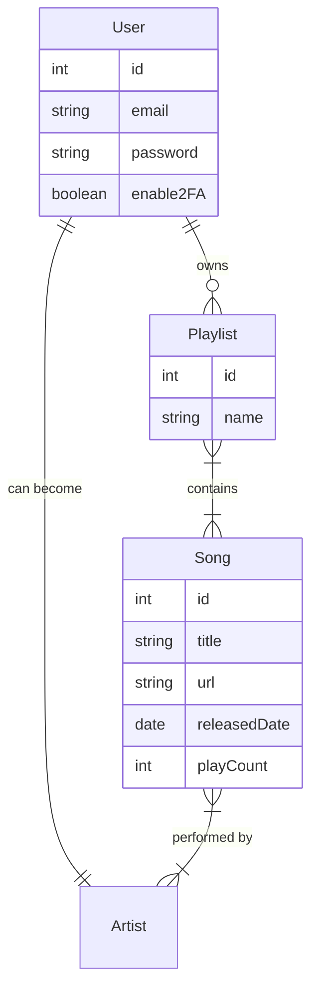

# 🏗️ System Architecture

## Overview

The application follows the **modular** architecture provided by NestJS. Each feature is encapsulated in its own module, containing its Controller, Service, and Entity.

## 📦 Modules

### 1. **AppModule** (Root)

The root module that orchestrates the entire application. It imports:

- `ConfigModule`: For environment variable management.
- `TypeOrmModule`: For database connection.
- Feature Modules: `SongsModule`, `AuthModule`, `UsersModule`, `PlayListsModule`, `ArtistsModule`.

### 2. **AuthModule**

Handles all authentication logic.

- **Strategies**:
  - `JWTStrategy`: Validates Bearer tokens.
  - `ApiKeyStrategy`: Validates custom API keys.
- **Guards**: `JwtArtistGuard` protects routes requiring authentication.
- **Services**: `AuthService` manages login, registration, and 2FA.

### 3. **SongsModule**

Manages the music catalog.

- **Relationships**:
  - Many-to-Many with `Playlists`
  - Many-to-Many with `Artists`
- **Features**: Pagination, Search, Filtering.

### 4. **PlayListsModule**

Manages user collections.

- **Relationships**:
  - Many-to-One with `User` (Owner)
  - Many-to-Many with `Songs` (Content)

## 🗄️ Database Schema (ERD Logic)

## 🔄 Request Flow

1. **Client** sends Request -> **Controller** (Validation Pipes)
2. **Controller** calls -> **Service** (Business Logic)
3. **Service** calls -> **Repository** (Database Access)
4. **Repository** returns -> **Data**
5. **Controller** returns -> **Response** (DTO)
